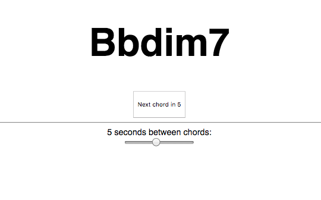

# Jazz Chordr

Memorise jazz chords by playing the corresponding chord on screen, which changes every few seconds.

Use the slider to extend or shorten the time between chord changes.

## Supported chord variations

* 7
* maj7
* min7
* dim7
* min7b5
* min7b5
